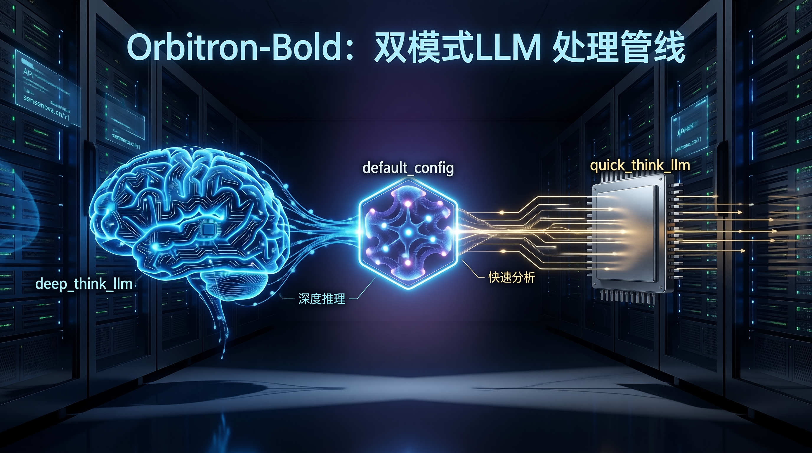
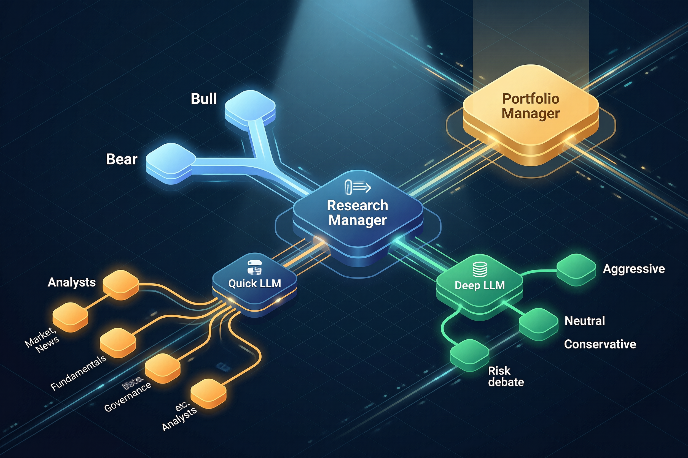
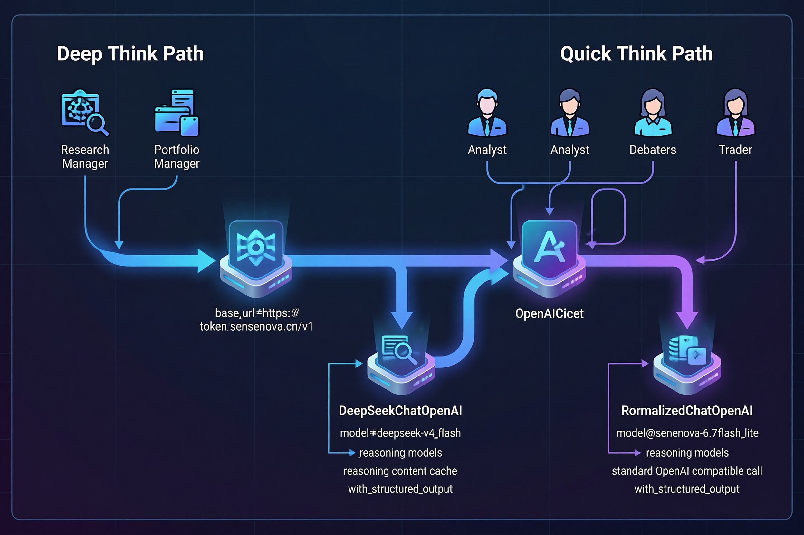

<p align="center">
  
</p>

<p align="center">
  
</p>

# Trading-Agents-A-Share

## A 股多 Agent 交易决策框架 · A-Share Multi-Agent Trading Framework

> 基于 [TradingAgents](https://github.com/TauricResearch/TradingAgents)（[arXiv 2412.20138](https://arxiv.org/abs/2412.20138)）的 A 股一站式实现

[](#-a-股核心能力)
[](https://github.com/langchain-ai/langgraph)
[](https://arxiv.org/abs/2412.20138)
[](LICENSE)

---

## 简介

`Trading-Agents-A-Share` 是为 **中国 A 股市场**深度定制的多 Agent 交易决策框架。它以 TradingAgents 多 Agent 架构为基础，把通用 LLM 交易流水线换成 A 股原生的数据源、标的解析、报告输出与持久化方案。

它要解决的是：**让 A 股用户开箱即用 TradingAgents 的多 Agent 能力，而不必自己解决 yfinance 拿不到 A 股数据、中文公司名识别、人民币金额展示、A 股特色数据维度（龙虎榜 / 资金流 / 股权质押 / 融资融券）等工程问题。**

---

## A 股核心能力

| 维度 | 能力 |
|---|---|
| **数据源** | AkShare 直连东方财富（5 大 A 股特色数据维度 + 板块资金流 + 行业 + 宏观 + 研报） |
| **标的解析** | 中文公司名 → A 股代码自动识别（`平安银行` → `000001.SZ`） |
| **多市场** | A 股原生（`.SS` / `.SZ`），同时支持港股 / 日股 / 美股 / 伦敦 / 印度 / Crypto |
| **决策输出** | Trader 结构化输出建仓点 / 止损点 / 仓位比例（`TraderProposal` schema） |
| **持久化** | 决策日志（`~/.tradingagents/memory/`）+ LangGraph checkpoint resume（崩溃自动续跑） |
| **报告** | 中文报告输出 + 公司名消毒（防 LLM 幻觉国企 / 股票代码） |
| **LLM** | 国内 4 家（Qwen / GLM / DeepSeek / SenseNova）+ 国际 5 家（OpenAI / Anthropic / Google / xAI / OpenRouter） |
| **工具** | 中文 Rich TUI dashboard + 批量并发（默认 3 workers）+ watchlist / profile 持久化 |
| **测试** | 432 unit tests 全通（`uv run pytest -m unit`） |

---

## 架构

<p align="center">
  
</p>

```
                   ┌────────────────────────┐
                   │  Fundamentals Analyst  │
                   └───────────┬────────────┘
                               ▼
┌──────────────┐  ┌────────────────────────┐  ┌──────────────┐
│ Market       ├─►│  Bull vs Bear Debate   │◄─┤ Governance   │
│ Analyst      │  │   (Research Manager)   │  │ Analyst      │
└──────────────┘  └───────────┬────────────┘  └──────────────┘
                               ▼
┌──────────────┐  ┌────────────────────────┐  ┌──────────────┐
│ Industry     ├─►│      Trader Agent      │◄─┤ News         │
│ Analyst      │  │ (Entry / Stop / Size)  │  │ Analyst      │
└──────────────┘  └───────────┬────────────┘  └──────────────┘
                               ▼
                   ┌────────────────────────┐
                   │  Risk Debate → PM      │
                   │ (Aggr / Neutral / Conserv) │
                   └────────────────────────┘
```

执行流程：6 个 Analyst 并行跑 → 多空 Research Manager 辩论 → Trader 出结构化下单建议 → 风控三方辩论 → Portfolio Manager 拍板。完整 graph 见 `tradingagents/graph/setup.py`。

---

## A 股专属 Analyst 团队

| Analyst | 输入 | 输出 |
|---|---|---|
| **Market Analyst** | 行情 + 技术指标 + 板块资金流 | 趋势、支撑 / 阻力、动量信号 |
| **Industry Analyst** | 行业分类 + 宏观指标（CPI / PMI） | 行业景气度、宏观背景 |
| **Governance Analyst** | 股东户数 + 股权质押 + 融资融券 + 龙虎榜 + 大宗交易 | 治理风险、解禁压力、资金异动 |
| **News Analyst** | 全球新闻 + 公司公告 + 研报 | 事件影响、信息面 |
| **Fundamentals Analyst** | 财务三表 + 分红历史 + 业绩预告 | 财务健康、盈利预期 |
| **Sentiment Analyst** | 资金流向 + 北向持股 | 主力意图、市场情绪 |

6 个 Analyst 跑完后进入 Bull vs Bear 多空辩论（默认 2 轮），由 Research Manager 给出综合判断，Trader 据此输出 `TraderProposal`（建仓点 / 止损点 / 仓位比例），最后由 Portfolio Manager 拍板。

---

## 标的与市场

**A 股优先**（这是本 fork 的核心场景）：

```python
# 交易所后缀
"600519.SS"  # 沪市主板（贵州茅台）
"000001.SZ"  # 深市主板（平安银行）
"301236.SZ"  # 深市创业板
"830799.BJ"  # 北交所

# 中文公司名（自动解析）
"平安银行"   # → 000001.SZ
"贵州茅台"   # → 600519.SS
"宁德时代"   # → 300750.SZ
```

**其他市场**（同一套代码也能跑）：

| 市场 | 示例 ticker |
|---|---|
| 港股 | `0700.HK` |
| 日股 | `7203.T` |
| 美股 | `AAPL` |
| 伦敦 | `AZN.L` |
| 印度 | `RELIANCE.NS`, `.BO` |
| Crypto | `BTC-USD`, `ETH-USD` |

非 A 股市场走 yfinance，A 股走 AkShare 走东方财富；路由在 `tradingagents/dataflows/interface.py` 自动完成。

---

## 快速上手

```bash
# 1. 克隆（使用 uv 管理依赖，详见 CLAUDE.md）
git clone https://github.com/Golden0Voyager/Trading-Agents-A-Share.git
cd Trading-Agents-A-Share
uv venv && source .venv/bin/activate
uv pip install -e .

# 2. 配置 API key
cp .env.example .env
# 编辑 .env，填入至少一个 LLM provider 的 key

# 3. 跑单 ticker 分析
tradingagents
# 按提示选 ticker（如 "平安银行" 或 "000001.SZ"）、日期、LLM provider

# 4. 跑批量回测
tradingagents analyze --watchlist my-list --workers 3
# 报告输出到 reports/batch_YYYYMMDD_HHMMSS/<ticker>/complete_report.md
```

---

## 持久化与回测

- **决策日志** `~/.tradingagents/memory/trading_memory.md`：每次跑完自动追加决策；下次跑同 ticker 时 PM 提示词会带历史决策 + 实际收益 + 反思
- **Checkpoint resume**：长跑任务崩溃后自动从上次成功的节点续跑（`--checkpoint` 开启）
- **批量并发**：`--workers N` 控制并行度（默认 3），进度条 + 中文 dashboard
- **报告审计**：`python scripts/report_auditor.py reports/batch_20260606_120000` 跨报告交叉验证

---

## A 股回测与表现

> 这一段是**占位**：我们正在积累回测数据。已有的批跑结果：

| Ticker | 公司 | 分析日期 | 决策 | 7 日实际收益 | 报告 |
|---|---|---|---|---|---|
| `000001.SZ` | 平安银行 | 2026-06-06 | 待补 | 待补 | [报告](reports/20260606_batch_my/000001.SZ/complete_report.md) |
| `600519.SS` | 贵州茅台 | — | — | — | — |
| `300750.SZ` | 宁德时代 | — | — | — | — |

**重要说明**：LLM 框架非保证收益工具。回测表现受模型、温度、时间范围、数据质量、采样随机性影响。结果仅供多 Agent 分析研究，不构成投资建议。详见 TradingAgents 原始 README 的 Reproducibility 章节。

---

### 双 LLM 设计

<p align="center">
  
</p>

**双 LLM 路径**：Deep Think（Research Manager / Trader / Portfolio Manager）走深度推理；Quick Think（6 个 Analyst + 5 个辩论角色）走并行工具调用。`Trading-Agents-A-Share` 在此基础上把 LLM factory 拓展到 9 家国内国际 provider + 2 个 A 股特殊 reasoning client（`DeepSeekChatOpenAI` / `MiniMaxChatOpenAI`）。

---

## 安装与配置

### uv（推荐，匹配 `CLAUDE.md`）

```bash
uv venv
source .venv/bin/activate
uv pip install -e .
```

### pip（备选）

```bash
pip install -e .
```

### 国内 LLM（任选其一）

```bash
export DASHSCOPE_API_KEY=...      # Qwen（通义千问）
export ZHIPU_API_KEY=...          # GLM（智谱）
export DEEPSEEK_API_KEY=...       # DeepSeek
export SENSENOVA_API_KEY=...      # SenseNova Token Plan（商汤）
```

### 国际 LLM（任选其一）

```bash
export OPENAI_API_KEY=...         # OpenAI
export ANTHROPIC_API_KEY=...      # Anthropic Claude
export GOOGLE_API_KEY=...         # Google Gemini
export XAI_API_KEY=...            # xAI Grok
export OPENROUTER_API_KEY=...     # OpenRouter（聚合）
```

### 本地模型

```bash
export OLLAMA_BASE_URL=http://localhost:11434/v1   # 默认；改远程地址即可
```

### 高级

```bash
# 覆盖 DEFAULT_CONFIG 任意字段
export TRADINGAGENTS_LLM_PROVIDER=qwen
export TRADINGAGENTS_DEEP_THINK_LM=qwen3-max
export TRADINGAGENTS_MAX_DEBATE_ROUNDS=3

# 国内 / 国际 endpoint 切换
export DASHSCOPE_CN_API_KEY=...    # Qwen 国内
export ZHIPU_CN_API_KEY=...        # GLM 国内
```

---

## 问题反馈

遇到 bug 或有改进建议：

- 提 Issue：<https://github.com/Golden0Voyager/Trading-Agents-A-Share/issues>
- 跑 `python scripts/report_auditor.py reports/<batch_dir>` 自检报告

详细集成文档见 [`docs/`](docs/)。

---

## 引用

如果这个框架对你的量化研究有帮助，请引用 TradingAgents 原始工作：

```bibtex
@misc{xiao2025tradingagentsmultiagentsllmfinancial,
      title={TradingAgents: Multi-Agents LLM Financial Trading Framework},
      author={Yijia Xiao and Edward Sun and Di Luo and Wei Wang},
      year={2025},
      eprint={2412.20138},
      archivePrefix={arXiv},
      primaryClass={q-fin.TR},
      url={https://arxiv.org/abs/2412.20138},
}
```

---

## 致谢

- [Tauric Research](https://github.com/TauricResearch) — TradingAgents 原始作者
- 所有贡献者
